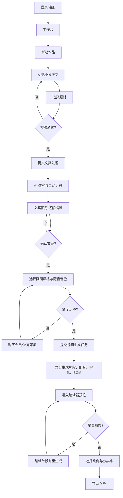
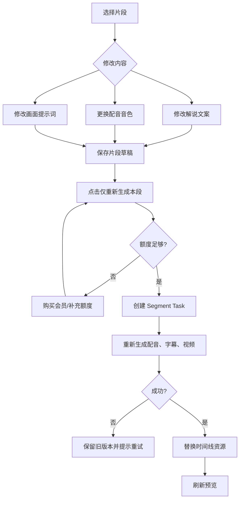

# 文影·网文转视频助手 — 产品设计文档

> 版本：v0.1
> 日期：2026-09-04
> 依据：`网文转视频_PRD_v0.1.md`
> 文档状态：设计初稿，待评审

## 1. 文档说明

### 1.1 设计目标

本文档将 PRD 中的产品构想转化为可供产品、设计、前后端和测试共同执行的设计方案，重点解决以下问题：

1. 用户如何从小说正文快速生成一条可预览、可修改、可导出的解说视频。
2. AI 生成耗时较长时，任务如何异步运行、反馈进度并支持失败恢复。
3. 用户只修改一个片段时，如何只重新生成该片段，不影响其他内容。
4. 会员额度、作品、素材和生成任务如何关联与管理。

### 1.2 设计范围

本版本以 MVP 为设计基线，包含：

- 手机号/邮箱/微信登录（具体登录方式按开发阶段可用性确定）。
- 粘贴小说文本并选择题材。
- AI 改写解说文案、自动分段、文案预览与逐段编辑。
- 选择画面风格和配音音色。
- 分段生成 AI 视频、配音、基础字幕和 BGM。
- 编辑器预览、单段重生成、MP4 导出。
- 会员订阅、用量配额和作品管理。

以下能力只预留数据结构和接口扩展，不纳入 MVP 交付：文件上传、链接抓取、章节识别、批量生成、多角色配音、时间线拖拽排序、环境音效、直接发布平台。

### 1.3 关键设计原则

- 先确认文案，再消耗高成本的视频生成额度。
- 所有长耗时操作都使用异步任务，页面关闭后任务仍继续执行。
- 片段是最小可重用、可重试、可替换单元。
- 生成结果和编辑数据分离保存，用户修改文案后可追溯历史版本。
- 默认提供合理结果，同时明确告知 AI 生成状态、预计耗时、额度消耗和版权责任。

## 2. 产品角色与核心对象

### 2.1 角色

| 角色 | 权限与职责 |
|---|---|
| 普通用户 | 创建作品、生成视频、编辑和导出；受免费额度限制 |
| 会员用户 | 使用会员额度或更高额度，享受更长的作品保存时间 |
| 管理员 | 管理用户、会员、额度、任务、素材和异常任务；不属于普通用户端 MVP |

### 2.2 核心对象

| 对象 | 定义 |
|---|---|
| 作品 Project | 一次小说转视频项目，包含原始输入、配置、文案、片段和导出记录 |
| 文案版本 Script Version | AI 改写或用户编辑后的一份完整文案快照 |
| 文案片段 Segment | 文案被按语义拆分后的最小视频生产单元 |
| 角色 Character | 小说中被识别或由系统维护的角色及其参考图；MVP 只支持基础一致性方案 |
| 媒体素材 Asset | 片段视频、配音、字幕、BGM、封面和导出视频等文件 |
| 生成任务 Generation Task | 针对整部作品或单个片段的一次异步生产任务 |
| 导出任务 Export Task | 使用当前片段结果合成指定比例和分辨率 MP4 的任务 |

## 3. 信息架构与页面结构

### 3.1 页面地图

```text
登录/注册
  └─ 工作台
      ├─ 新建作品
      │   ├─ 内容输入
      │   ├─ 文案处理进度
      │   └─ 文案预览与编辑
      ├─ 视频生成配置
      ├─ 视频生成进度
      ├─ 视频编辑器
      │   ├─ 预览播放器
      │   ├─ 片段列表/时间线
      │   └─ 片段属性与精修面板
      ├─ 作品管理
      ├─ 会员与额度
      └─ 账号设置
```

### 3.2 全局导航

桌面端采用左侧主导航，顶部展示当前账号、会员状态和剩余额度。

| 导航项 | 说明 |
|---|---|
| 工作台 | 最近作品、继续编辑、创建新作品 |
| 新建作品 | 进入小说文本输入页 |
| 我的作品 | 查看、编辑、删除、导出历史作品 |
| 会员中心 | 查看套餐、额度和订阅状态 |
| 帮助与版权 | 使用说明、版权提示和问题反馈 |

## 4. 核心操作流程

### 4.1 MVP 主流程



### 4.2 流程一：注册/登录

1. 用户进入产品，系统判断是否存在有效登录态。
2. 未登录用户选择手机号、邮箱或微信登录。
3. 手机号/邮箱登录使用验证码；首次登录自动创建账号并同意服务协议、隐私政策。
4. 登录成功后进入工作台。
5. 登录态建议使用短期 access token + 可轮换 refresh token；退出登录时注销当前设备登录态。

异常处理：

- 验证码错误：提示剩余尝试次数，连续失败后短暂限制。
- 验证码过期：允许重新发送，并展示发送倒计时。
- 账号已在其他设备登录：不强制下线，提示用户检查账号安全。

### 4.3 流程二：创建作品与输入文本

#### 页面目标

让用户在一次操作中完成文本输入和题材选择，并在提交前确认文本长度、预计片段数量和额度消耗。

#### 操作步骤

1. 用户点击“新建作品”。
2. 输入作品名称；未填写时可根据文本首行生成临时名称。
3. 在大文本框粘贴小说正文。
4. 选择题材：玄幻、都市、悬疑、言情、历史、科幻、其他。
5. 系统实时显示字符数、预计口播时长、预计视频片段数。
6. 用户勾选“我确认已获得相关内容的合法使用授权”。
7. 点击“开始生成解说文案”。

#### 输入校验

| 校验项 | 规则 | 反馈 |
|---|---|---|
| 作品名称 | 1-50 个字符；为空时允许自动生成 | 输入框下方提示 |
| 正文 | MVP 建议单次 500-30,000 字，可配置 | 少于最小字数或超过上限时禁止提交 |
| 题材 | 必选 | 未选择时提示“请选择小说题材” |
| 授权确认 | 必须勾选 | 未勾选时禁止进入 AI 处理 |
| 内容安全 | 提交前进行基础敏感内容检测 | 命中风险时提示修改或人工申诉入口 |

#### 预估规则

- 预计口播时长 = 文案预估字数 ÷ 默认语速。
- 预计片段数 = 改写后文案预估时长 ÷ 5-15 秒片段目标时长。
- 初步预估只用于提示，AI 改写完成后以实际片段数和实际额度为准。

### 4.4 流程三：AI 文案处理与进度反馈

1. 用户提交后创建作品和文案处理任务，页面进入处理状态。
2. 系统执行：文本清洗 → 解说改写 → 语义分段 → 基础角色/场景识别。
3. 前端通过 WebSocket 接收任务进度；断线后通过查询接口补齐最新状态。
4. 处理成功后进入“文案预览”页。
5. 处理失败时保留作品和输入数据，允许用户点击“重试”。

建议进度展示：

```text
准备文本       ✓
生成解说文案   处理中  60%
自动切分片段   等待中
整理生成配置   等待中
```

设计要求：

- 不展示虚假的精确剩余时间；可展示“通常需要 10-30 秒”。
- 处理期间允许用户离开页面，回到工作台后可继续查看。
- 文案处理成功才进入视频生成计费阶段；失败不扣除视频生成额度。

### 4.5 流程四：文案预览与逐段编辑

#### 页面布局

```text
┌──────────────────────────────────────────────┐
│ 返回工作台   作品名称       保存状态   下一步 │
├───────────────┬──────────────────────────────┤
│ 片段目录      │ 当前片段编辑区                 │
│ 01 片段标题   │ 文案文本编辑器                 │
│ 02 片段标题   │ 原文摘要/改写提示（可选）      │
│ 03 片段标题   │ 字数、预计时长、保存            │
├───────────────┴──────────────────────────────┤
│ 全文文案预览 / 角色与场景摘要 / 确认并生成视频 │
└──────────────────────────────────────────────┘
```

#### 操作步骤

1. 系统默认选中第一个片段，左侧展示所有片段状态和预计时长。
2. 用户点击片段查看或编辑解说文案。
3. 用户可保存当前片段；保存后标记为“已修改”。
4. 用户可切换片段，未保存内容需要二次确认。
5. 用户点击“确认文案并生成视频”后，系统保存完整文案版本并进入生成配置页。

#### 交互规则

- AI 生成文案默认可编辑，不覆盖用户已保存的修改。
- 文案修改不会立即消耗视频生成额度。
- 进入视频生成后再次修改文案，必须通过“单段重生成”生效。
- 文案为空时禁止保存；单段过长时给出“可能生成较长画面”的提示，不强制截断。
- 切换片段时自动保存草稿；服务端保存失败时保留本地草稿并提示重试。

### 4.6 流程五：生成配置与额度确认

用户确认文案后设置本次视频的统一配置：

| 配置 | MVP 选项 | 作用范围 |
|---|---|---|
| 画面风格 | 写实、动漫、国风、赛博朋克 | 全部片段 |
| 配音音色 | 沉稳男声、甜美女声、磁性旁白等 | 全部片段 |
| 字幕样式 | 基础白字黑描边、底部位置 | 全部片段；MVP 可在编辑器统一调整 |
| 画面比例 | 默认 9:16；导出时确认 | 最终导出 |
| 分辨率 | 默认 1080p；支持 720p | 最终导出 |

点击生成前展示确认弹窗：

```text
本次预计生成：12 个片段 / 约 4 分 20 秒
预计消耗：12 次生成额度
预计耗时：5-15 分钟
视频内容由 AI 生成，请确认拥有原文使用权。
[取消] [确认并开始生成]
```

额度扣减建议采用“预占—结算”机制：

1. 提交时按预计片段数预占额度。
2. 实际生成成功的片段完成结算。
3. 失败且重试耗尽的片段释放预占额度。
4. 用户取消任务时，已成功生成的片段按实际使用结算，未处理部分释放。

### 4.7 流程六：异步视频生成


任务按“作品级任务 + 片段级子任务”组织：

- 作品级任务负责调度、总体进度、额度结算和最终状态。
- 片段级子任务负责单段 TTS、视频、字幕及素材状态。
- 同一作品的片段可有限并发，避免第三方 API 限流和服务器资源争抢。
- 每一步都写入任务日志和结果引用，Worker 重启后可从最后成功步骤继续。

前端状态：

| 状态 | 页面表现 | 可执行操作 |
|---|---|---|
| 排队中 | 显示排队位置或“等待资源” | 返回工作台、取消 |
| 处理中 | 展示当前步骤和片段进度 | 返回工作台、取消未处理部分 |
| 部分成功 | 显示成功/失败片段数量 | 重试失败片段、进入编辑器 |
| 已完成 | 显示“进入编辑器” | 预览、精修、导出 |
| 已取消 | 显示已生成结果保留范围 | 进入编辑器、重新生成 |
| 失败 | 展示可读错误原因和任务编号 | 重试、联系客服 |

### 4.8 流程七：进入编辑器与完整预览

#### 编辑器布局

```text
┌──────────────────────────────────────────────────────┐
│ 返回作品  作品名称       保存状态          导出       │
├──────────────────────┬───────────────────────────────┤
│                      │ 片段属性面板                    │
│   视频预览播放器      │ 文案 / 配音 / 画面提示词        │
│                      │ [保存] [仅重新生成本段]         │
├──────────────────────┴───────────────────────────────┤
│ 01 视频缩略图 │ 02 视频缩略图 │ 03 视频缩略图          │
│    配音波形   │    配音波形   │    配音波形            │
└──────────────────────────────────────────────────────┘
```

#### 操作规则

1. 用户点击片段缩略图，播放器跳转到该片段起点，右侧打开片段属性。
2. 播放器支持播放完整视频、当前片段和暂停/继续。
3. 片段状态显示为“就绪、生成中、生成失败、已修改、待重新生成”。
4. 只有存在可播放视频素材的片段才能进入完整预览；失败片段以占位卡片标识。
5. 用户修改文案、配音或画面提示词后，点击“仅重新生成本段”。
6. 生成期间该片段锁定编辑，其他片段继续可预览和编辑。
7. 新片段生成成功后替换当前片段资源，保留旧资源一段时间供撤销和故障排查。

### 4.9 流程八：单段精修与重生成



细则：

- 只改画面提示词：默认只重生成视频，保留原配音和字幕。
- 只改配音音色：重新生成配音和字幕，视频画面可复用。
- 修改文案：重新生成配音、字幕；视频是否重生成由用户确认，默认建议同步重生成。
- 片段重生成失败时不得覆盖旧版本，用户仍可播放和导出上一版。
- 每次重生成写入版本记录，保存“生成参数快照、素材地址、创建人、时间和状态”。

### 4.10 流程九：导出 MP4

1. 用户在编辑器点击“导出”。
2. 选择比例：9:16、16:9、1:1；默认使用 9:16。
3. 选择分辨率：720p 或 1080p；默认使用 1080p。
4. 系统检查是否存在生成中或失败片段。
5. 若有失败片段，禁止导出并定位到对应片段；若仅有生成中片段，提示等待完成。
6. 系统创建导出任务，使用当前有效片段版本进行 FFmpeg 合成。
7. 合成完成后上传对象存储，生成带有效期的下载地址。
8. 用户可在线播放或下载 MP4；导出记录写入作品详情。

导出内容：片段视频、配音、BGM 混音、字幕烧录、AI 生成标识和必要的版权提示。

### 4.11 流程十：作品管理

作品列表展示：封面、标题、题材、状态、总时长、片段数、最近更新时间和导出状态。

用户可执行：

- 继续编辑：进入最近一次可恢复的编辑状态。
- 查看：播放已生成结果。
- 重新导出：使用已有片段重新选择比例/分辨率导出，不重新调用 AI 视频 API。
- 复制作品：复制文案与配置，生成新的作品版本；是否复用素材由系统按缓存策略决定。
- 删除作品：二次确认后删除业务记录，并异步清理对象存储资源。

## 5. 页面与交互设计

### 5.1 工作台

首屏展示三个区域：

1. “新建作品”主按钮。
2. 最近作品卡片，优先显示处理中和可继续编辑的作品。
3. 会员和额度卡片，展示“本月剩余 X 次 / 预计可生成约 X 个片段”。

空状态文案：

> 还没有作品。粘贴一段小说正文，先生成解说文案，确认后再制作视频。

### 5.2 文案预览页

核心组件：

- 片段目录：编号、首句、字数、预计时长、修改状态。
- 文案编辑器：支持普通文本编辑，MVP 不做富文本排版。
- 全文预览：按片段顺序展示完整解说稿。
- 处理摘要：展示角色和场景（若接口已返回；MVP 可隐藏入口）。
- 固定底部操作栏：保存草稿、返回、确认文案并生成视频。

### 5.3 视频生成页

以“步骤 + 片段进度”为主要信息：

- 顶部显示作品名称、总体进度和预计耗时。
- 中部显示流水线步骤：文案、配音、画面、字幕、BGM、合成。
- 下部按片段展示缩略图占位、当前状态和失败原因。
- 提供“返回工作台”；返回后任务持续执行。

### 5.4 编辑器

MVP 采用“片段级时间线”，不实现专业剪辑软件的自由轨道：

- 左侧/底部按顺序排列片段卡片。
- 中间为播放器。
- 右侧为当前片段属性面板。
- 文案、配音、画面提示词分别提供编辑入口。
- 顶部显示保存状态：已保存、保存中、保存失败。

### 5.5 导出弹窗

弹窗内明确展示：

- 比例和分辨率选项。
- 视频时长、文件大小预估（可选）。
- AI 生成标识和版权责任提示。
- 导出按钮及导出任务进度。

## 6. 业务状态与规则

### 6.1 作品状态

```text
draft
  → script_processing
  → script_ready
  → video_queued
  → video_processing
  → ready
  → editing
  → exporting
  → exported
```

异常分支：

```text
script_processing → script_failed → script_processing
video_processing  → partial_failed → video_processing
video_processing  → video_failed   → video_processing
exporting         → export_failed  → exporting
```

状态规则：

- `script_ready` 才能提交视频生成。
- `video_processing` 允许返回工作台，不允许删除正在运行的作品。
- `partial_failed` 允许进入编辑器，但不允许导出，直到失败片段成功或被明确移除（移除功能属于二期）。
- 删除采用软删除，后台异步清理文件。

### 6.2 片段状态

```text
created → generating_audio → generating_video → ready
                                      └→ failed → retrying
```

片段的文案版本变化时，旧素材不能直接标记为当前有效素材；需创建新的 `segment_version`，成功后再切换 `active_version_id`。

### 6.3 自动保存与版本

- 文案编辑输入停止 800ms 后保存草稿，服务端接口需要幂等。
- 离开页面前主动提交一次保存请求。
- 每次整稿确认生成时创建不可变的文案快照。
- 每次片段重生成创建片段版本，最多保留最近 5 个版本，超出部分转冷存储或清理。

### 6.4 额度规则

- 额度按“成功生成的视频片段数”计费，文案处理不扣视频额度。
- 重生成一个片段按一个片段额度计算。
- 导出已有素材不重复扣视频生成额度。
- 任务提交时预占额度，任务结束时按成功结果结算。
- 所有额度变化写入不可变流水，禁止只修改用户余额而不留记录。

## 7. 技术架构设计

### 7.1 总体架构

```text
浏览器（Vue3 + TypeScript + Pinia）
        │ HTTPS / WebSocket
        ▼
API 服务（NestJS）
  ├─ 认证与用户模块
  ├─ 作品与文案模块
  ├─ 生成任务调度模块
  ├─ 会员与额度模块
  ├─ 导出模块
  └─ WebSocket 进度网关
        │
        ├─ MySQL：用户、作品、文案、片段、任务、额度、导出记录
        ├─ Redis + BullMQ：异步队列、锁、短期状态、限流
        ├─ 对象存储：视频、音频、图片、字幕、封面
        └─ AI Provider Adapter
              ├─ LLM：文案改写、分段、角色/场景提取
              ├─ TTS：配音和时间戳
              ├─ Text-to-Video：视频片段
              └─ ASR（可选）：逐字字幕校准

独立 Worker 集群
  ├─ Script Worker
  ├─ Audio Worker
  ├─ Video Worker
  └─ Render Worker（FFmpeg）
```

### 7.2 前端模块

```text
src/
├─ modules/auth                 # 登录、登录态
├─ modules/workspace            # 工作台、作品列表
├─ modules/project-input        # 文本输入、校验、题材选择
├─ modules/script-editor        # 文案预览、分段编辑
├─ modules/generation           # 生成配置、进度、任务状态
├─ modules/video-editor         # 播放器、片段时间线、精修面板
├─ modules/export               # 导出配置、导出状态
├─ stores/                      # Pinia 状态
├─ services/                    # HTTP/WebSocket 客户端
└─ components/                  # 通用组件
```

前端状态应区分：

- 服务端状态：作品、片段、任务和导出记录，以接口返回为准。
- 编辑草稿状态：当前未提交的文案、提示词和配置。
- 播放器状态：当前时间、当前片段、播放/暂停。
- 实时任务状态：WebSocket 更新，断线时回退到轮询查询。

### 7.3 后端模块

| 模块 | 职责 |
|---|---|
| AuthModule | 注册、登录、令牌、设备会话 |
| UserModule | 用户资料、会员状态 |
| ProjectModule | 作品创建、查询、复制、删除 |
| ScriptModule | 文本清洗、文案版本、片段编辑 |
| GenerationModule | 任务创建、状态查询、重试、取消 |
| AssetModule | 媒体上传、签名地址、生命周期 |
| BillingModule | 套餐、支付回调、额度预占与结算 |
| ExportModule | 导出配置、FFmpeg 合成、下载地址 |
| ProviderModule | 第三方 AI 服务适配、超时、重试、降级 |
| NotificationModule | WebSocket 进度及站内通知 |

## 8. 数据设计

### 8.1 主要数据关系

```text
User 1 ── N Project
User 1 ── N Subscription
User 1 ── N QuotaLedger
Project 1 ── N ScriptVersion
Project 1 ── N Segment
Segment 1 ── N SegmentVersion
SegmentVersion 1 ── N Asset
Project 1 ── N GenerationTask
GenerationTask 1 ── N SegmentTask
Project 1 ── N ExportTask
```

### 8.2 核心表建议

#### `users`

| 字段 | 说明 |
|---|---|
| id | 用户 ID |
| login_type | phone/email/wechat |
| login_identifier_hash | 登录标识哈希 |
| nickname | 昵称 |
| status | active/blocked |
| created_at, updated_at | 时间 |

#### `projects`

| 字段 | 说明 |
|---|---|
| id | 作品 ID |
| user_id | 所属用户 |
| title | 作品名称 |
| genre | 题材 |
| source_text_cipher | 加密后的原文，可按隐私策略删除 |
| status | 作品状态 |
| active_script_version_id | 当前文案版本 |
| active_generation_task_id | 当前生成任务 |
| created_at, updated_at | 时间 |

#### `segments`

| 字段 | 说明 |
|---|---|
| id | 片段 ID |
| project_id | 所属作品 |
| sequence | 顺序 |
| title | 片段标题/摘要 |
| active_version_id | 当前有效片段版本 |
| status | 片段状态 |

#### `segment_versions`

| 字段 | 说明 |
|---|---|
| id | 版本 ID |
| segment_id | 所属片段 |
| script_text | 当前解说文案 |
| prompt_text | 画面提示词 |
| voice_id | 配音音色 |
| duration_ms | 预计/实际时长 |
| source | ai/user |
| created_by | 创建来源用户/系统 |

#### `assets`

| 字段 | 说明 |
|---|---|
| id | 素材 ID |
| project_id | 所属作品 |
| segment_version_id | 关联片段版本，可为空 |
| type | video/audio/subtitle/bgm/cover/export |
| object_key | 对象存储 Key |
| checksum | 文件校验值 |
| duration_ms, size_bytes | 媒体信息 |
| status | uploading/ready/deleted |

#### `generation_tasks`

| 字段 | 说明 |
|---|---|
| id | 任务 ID |
| project_id | 所属作品 |
| type | script/video/segment |
| status | pending/running/partial_failed/succeeded/failed/canceled |
| current_step | 当前流水线步骤 |
| progress | 0-100 |
| reserved_quota | 预占额度 |
| consumed_quota | 实际消耗 |
| idempotency_key | 幂等键 |
| error_code, error_message | 错误信息 |

#### `quota_ledgers`

| 字段 | 说明 |
|---|---|
| id | 流水 ID |
| user_id | 用户 ID |
| task_id | 关联任务 |
| type | grant/reserve/consume/release/refund |
| amount | 变动数量，统一使用正负约定 |
| balance_after | 变动后余额 |
| created_at | 时间 |

### 8.3 原文隐私策略

默认不长期保存用户粘贴的原文。建议流程如下：

1. 原文在传输过程中使用 HTTPS。
2. 处理期间以加密形式短期保存，用于任务恢复。
3. 文案处理成功后默认删除原文，或仅保留用户明确开启的“保存原文”版本。
4. 日志禁止打印原文、完整文案和音频内容，只记录长度、哈希和任务 ID。

## 9. API 设计草案

### 9.1 认证

```text
POST /api/v1/auth/send-code
POST /api/v1/auth/login
POST /api/v1/auth/logout
GET  /api/v1/me
```

### 9.2 作品与文案

```text
POST /api/v1/projects
GET  /api/v1/projects
GET  /api/v1/projects/:projectId
PATCH /api/v1/projects/:projectId
DELETE /api/v1/projects/:projectId

POST /api/v1/projects/:projectId/script-tasks
GET  /api/v1/projects/:projectId/script-versions
GET  /api/v1/projects/:projectId/segments
PATCH /api/v1/segments/:segmentId/draft
POST /api/v1/projects/:projectId/script/confirm
```

创建作品请求示例：

```json
{
  "title": "夜行者",
  "genre": "mystery",
  "sourceText": "小说正文……",
  "copyrightConfirmed": true
}
```

### 9.3 生成与精修

```text
POST /api/v1/projects/:projectId/generation-tasks
GET  /api/v1/generation-tasks/:taskId
POST /api/v1/generation-tasks/:taskId/cancel
POST /api/v1/generation-tasks/:taskId/retry
POST /api/v1/segments/:segmentId/regenerate
```

生成请求示例：

```json
{
  "visualStyle": "realistic",
  "voiceId": "narrator_female_01",
  "subtitleStyle": "basic-outline",
  "bgmPolicy": "auto",
  "idempotencyKey": "client-generated-uuid"
}
```

### 9.4 导出与额度

```text
POST /api/v1/projects/:projectId/export-tasks
GET  /api/v1/export-tasks/:taskId
GET  /api/v1/projects/:projectId/exports
GET  /api/v1/quota
GET  /api/v1/memberships/plans
POST /api/v1/payments/create
POST /api/v1/payments/webhook
```

### 9.5 WebSocket 事件

客户端连接后订阅作品或任务：

```text
subscribe: generation-task:{taskId}
subscribe: project:{projectId}
```

服务端事件：

```json
{
  "event": "generation.progress",
  "taskId": "task_123",
  "projectId": "project_123",
  "step": "video",
  "progress": 68,
  "segmentId": "segment_08",
  "status": "running"
}
```

## 10. 异步任务与第三方服务设计

### 10.1 流水线

```text
提交任务
  → 校验文案快照和额度
  → 额度预占
  → 写入 MySQL
  → 推入 BullMQ
  → Worker 获取分布式锁
  → 文案/配置快照确认
  → 分段 TTS
  → 根据 TTS 时间轴生成字幕
  → 读取或生成角色参考图
  → 分段文生视频
  → 自动匹配 BGM
  → 生成片段预览
  → 更新作品状态和额度
```

### 10.2 Provider 适配层

第三方服务不能直接散落在业务代码中，统一通过 Provider 接口接入：

```ts
interface TextProvider {
  rewrite(input: RewriteInput): Promise<RewriteResult>;
}

interface TtsProvider {
  synthesize(input: TtsInput): Promise<AudioResult>;
}

interface VideoProvider {
  generate(input: VideoInput): Promise<VideoJobResult>;
  query(jobId: string): Promise<VideoJobStatus>;
}
```

MVP 可先接入一家文本模型、TTS 和文生视频服务，同时保留 provider、model、版本和请求参数，便于后续切换和成本对比。

### 10.3 重试与幂等

- 网络超时、限流、第三方 5xx：指数退避重试，最多 3 次。
- 参数错误、内容审核不通过：不自动重试，直接给出可读原因。
- 每个步骤使用 `task_id + segment_version_id + step` 生成幂等键。
- Worker 执行前检查结果是否已存在，存在则复用，不重复调用第三方 API。
- 第三方异步视频任务需要记录 provider_job_id，轮询或回调均可更新状态。

### 10.4 并发与限流

- 作品级任务按用户限流，避免单用户占满队列。
- Video Worker 使用独立队列，控制并发数和第三方 QPS。
- Render Worker 单独部署，避免 FFmpeg 占满 API 服务 CPU/内存。
- MVP 目标支持 50 个任务排队，不代表同时 50 个任务调用视频 API。

## 11. 安全、版权与合规

### 11.1 访问控制

- 所有作品、片段、素材和任务接口校验 `user_id` 归属，禁止仅依赖前端传入 ID。
- 对象存储使用私有桶，播放和下载通过短时效签名 URL。
- 支付回调必须校验平台签名，且支持幂等处理。
- 管理员操作写入审计日志。

### 11.2 内容与版权

- 输入页明确提示：用户需拥有小说内容的合法使用权。
- 对输入文本、改写文案和生成提示词进行内容安全检测。
- 导出视频默认增加 AI 生成标识；具体位置和形式由上线地区法规及平台要求确定。
- 不在普通日志、错误上报和客服工单中暴露完整原文。

### 11.3 资源生命周期

- 免费用户生成视频默认保存 7 天，会员默认保存 30 天。
- 到期前提醒用户导出；到期后清理大文件，保留必要的作品元数据。
- 删除作品时标记资源待删除，异步清理视频、音频、图片和字幕文件。

## 12. 性能与可观测性

### 12.1 性能目标

| 指标 | 目标 |
|---|---|
| 3000 字文案处理 | ≤ 30 秒 |
| 单条视频生成 | ≤ 15 分钟，目标 10 分钟内 |
| 预览首屏加载 | ≤ 3 秒，依赖 CDN 和分段资源 |
| 队列承载 | MVP 支持 50 个生成任务排队 |
| 页面接口 | 普通查询 P95 ≤ 500ms；任务提交 P95 ≤ 1s |

### 12.2 监控指标

- 任务：各步骤耗时、成功率、重试次数、队列等待时间。
- Provider：请求量、错误率、限流次数、单段成本、平均生成耗时。
- 业务：文案确认率、视频生成完成率、单段重生成率、导出成功率。
- 系统：API P95/P99、CPU/内存、Redis 队列长度、对象存储失败率。
- 费用：按用户、作品、Provider 统计估算成本与实际成本。

每条任务日志至少包含：`trace_id`、`user_id`、`project_id`、`task_id`、`segment_id`、`step`、`provider`、`status`、`duration_ms` 和错误码；禁止记录原始小说正文。

## 13. 错误处理与用户提示

| 错误场景 | 用户提示 | 用户可执行操作 |
|---|---|---|
| 文本过短/过长 | “请输入 500-30,000 字的正文” | 修改正文 |
| 文案处理失败 | “文案生成失败，请稍后重试；本次未扣视频额度” | 重试/返回修改 |
| 额度不足 | “当前额度不足以生成本次作品” | 购买会员/返回修改 |
| 视频服务超时 | “第 X 段生成超时，旧版本仍可用” | 重试本段 |
| 内容审核不通过 | “当前内容无法生成，请调整相关文本” | 修改文案 |
| 导出失败 | “视频合成失败，素材未丢失” | 重试导出/联系客服 |
| 网络中断 | “连接已断开，正在恢复任务状态” | 自动重连/手动刷新 |

错误提示避免直接展示第三方服务内部报错；服务端保留原始错误供排查，并映射为稳定的业务错误码。

## 14. 测试与验收标准

### 14.1 核心链路验收

- 用户可以完成登录、创建作品、粘贴文本、选择题材。
- 3000 字以内文本可在 30 秒内得到改写文案和分段结果。
- 用户可以编辑任意片段并保存，刷新页面后内容不丢失。
- 用户确认文案后可选择画面风格和音色并提交生成。
- 生成任务离开页面后继续执行，重新进入可看到准确进度。
- 视频生成完成后可在网页端播放完整视频。
- 修改单段后只生成并替换该段，其他片段的素材 ID 和版本不变化。
- 失败片段重试不会重复扣除已成功片段额度。
- 可选择 9:16、1080p 导出 MP4，并能在线播放和下载。
- 作品列表可查看、继续编辑和重新导出。

### 14.2 重点测试场景

1. 重复点击提交按钮，不应创建重复任务或重复扣额。
2. 浏览器刷新、关闭、网络断开后，任务状态可恢复。
3. 第三方视频接口超时、限流、回调重复和回调丢失时，任务最终状态正确。
4. 两个浏览器同时编辑同一作品时，服务端版本冲突可提示用户。
5. 用户 A 不能访问用户 B 的作品或对象存储文件。
6. 删除作品后，页面不可继续访问，异步清理不影响其他作品。
7. 原文包含特殊字符、超长段落、空行和敏感内容时，系统有明确反馈。

## 15. MVP 交付拆分建议

### 阶段一：基础骨架

- 登录态、工作台、作品模型、额度模型。
- 文本输入、题材选择、作品创建。
- LLM Provider 接入和文案处理任务。

### 阶段二：文案确认链路

- 自动分段、片段编辑、自动保存、文案版本。
- 任务进度、WebSocket 推送、失败重试。
- 生成配置和额度预占。

### 阶段三：媒体生成链路

- TTS 接入、时间轴/字幕生成。
- 文生视频 Provider 接入、角色参考图基础方案。
- BGM 匹配和素材存储。

### 阶段四：编辑、导出与验收

- 片段级时间线、播放器、单段重生成。
- FFmpeg Render Worker、MP4 导出和下载。
- 作品管理、支付回调、监控、异常和合规检查。

## 16. 待评审决策

开发启动前需要确认：

1. MVP 的具体预算、周期和目标用户规模。
2. 文生视频、TTS、LLM 的最终 Provider，以及同一组样例的效果和成本实测结果。
3. 原文是否保存、保存多久，以及用户是否可以主动保留原文。
4. 会员套餐的额度定义：按片段、按视频还是按分钟计费。
5. AI 生成标识的具体样式、位置和导出规范。
6. 国内上线所需的备案、内容审核和版权投诉流程。
7. FFmpeg Render Worker 的部署规格、并发数和资源清理策略。

---

**设计结论**：MVP 应围绕“文案先确认、片段可独立生成、任务可恢复、结果可导出”四个闭环建设。人物一致性、第三方视频接口稳定性和单条视频成本是上线前必须通过样例实测验证的关键风险。
